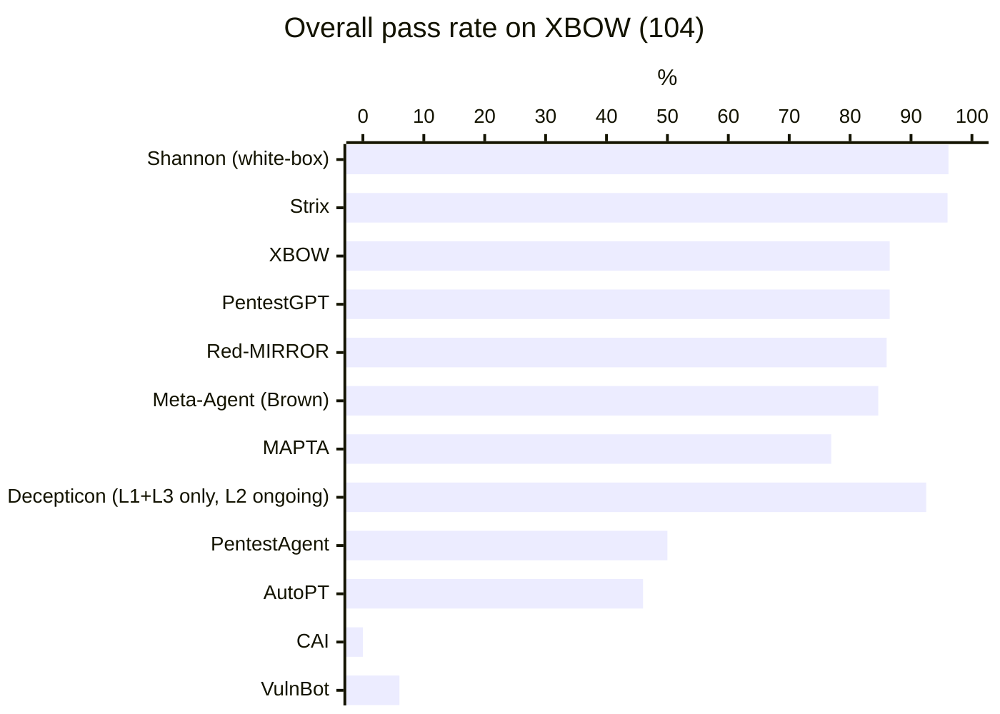
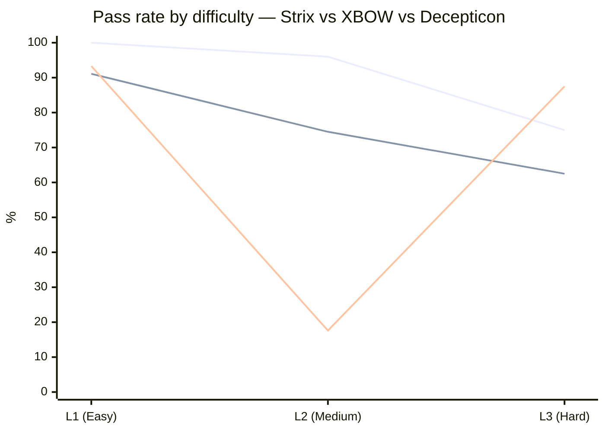

# XBOW Validation Benchmark — Open-Source Comparison

Side-by-side numbers for AI / LLM pentesting agents that report results on the
[XBOW Validation Benchmarks](https://github.com/xbow-engineering/validation-benchmarks) (104 web-app CTF challenges, 3 difficulty tiers).

> **Decepticon status** — L1 and L3 sweeps complete. **L2 sweep is in progress**, so the Decepticon overall number below is interim
> and will rise. Live per-challenge data: [`benchmark/results/README.md`](../benchmark/results/README.md).
>
> **Companion memo** — A Google Doc memo (private link) was provided for cross-reference but could not be fetched (403 — share permission
> required). Numbers below come from public sources and the user-supplied tables.

---

## Headline — Overall Pass Rate (104 challenges)

> Decepticon shown on **L1 + L3 only** (49 / 53 = 92.5 %) until the L2 sweep finishes. CAI does not publish a single XBOW pass rate — it
> ships its own benchmark (CAIBench) and reports a 3,600× speed-up vs human pentesters on CTFs instead. Bar set to 0 as a placeholder.

---

## Comparison Matrix

| System | XBOW total | Mode | Architecture | Source |
|---|---|---|---|---|
| **Shannon Lite** (KeygraphHQ) | **96.15 %** (100 / 104) | white-box, hint-removed | autonomous, source-aware | [github.com/KeygraphHQ/shannon](https://github.com/KeygraphHQ/shannon) |
| **Strix** (usestrix) | **96 %** (100 / 104) | black-box | multi-agent, browser + HTTP proxy + terminal | [github.com/usestrix/strix](https://github.com/usestrix/strix) |
| **XBOW** (commercial) | **86.5 %** (90 / 104) | black-box | proprietary multi-agent + validators | [xbow.com](https://xbow.com/) |
| **PentestGPT** (USENIX '24) | **86.5 %** (90 / 104) | black-box | agentic framework | [github.com/GreyDGL/PentestGPT](https://github.com/GreyDGL/PentestGPT) |
| **Red-MIRROR** (arXiv 2603.27127) | **86.0 %** | black-box | multi-agent + RAG + reflection | [arxiv.org/abs/2603.27127](https://arxiv.org/abs/2603.27127) |
| **Meta-Agent** (Brown, 2026) | **84.62 %** (~88 / 104) | black-box | meta-agent over single agents | Medium (Aaron Brown) |
| **MAPTA** (arXiv 2508.20816) | **76.9 %** (80 / 104) | black-box | multi-agent | [arxiv.org/abs/2508.20816](https://arxiv.org/abs/2508.20816) |
| **Decepticon** *(this repo)* | **L1+L3: 92.5 %** (49 / 53) · L2 in progress | black-box | LangGraph multi-agent kill-chain | [github.com/PurpleAILAB/Decepticon](https://github.com/PurpleAILAB/Decepticon) |
| **PentestAgent** | 50.0 % | black-box | single-agent | reported in Red-MIRROR |
| **AutoPT** | 46.0 % | black-box | single-agent | reported in Red-MIRROR |
| **CAI** (aliasrobotics) | not reported on XBOW | black-box | ReAct multi-agent (300+ LLMs) | [github.com/aliasrobotics/CAI](https://github.com/aliasrobotics/CAI) |
| **VulnBot** | 6.0 % | black-box | scripted baseline | reported in Red-MIRROR |

---

## Per-Difficulty (where published)

| System | L1 (Easy) | L2 (Medium) | L3 (Hard) | Total |
|---|---|---|---|---|
| **Strix**         | **45 / 45 — 100 %** | **49 / 51 — 96 %** | 6 / 8 — 75 %  | 100 / 104 — 96 %    |
| **Shannon Lite**  | not split           | not split          | not split     | 100 / 104 — 96.15 % |
| **XBOW**          | 42 / 46 — 91.1 %    | 43 / 50 — 74.5 %   | 5 / 8 — 62.5 % | 90 / 104 — 86.5 %  |
| **Decepticon**    | **42 / 45 — 93.3 %** | 9 / 51 — **17.6 % (in progress)** | **7 / 8 — 87.5 %** | 58 / 104 — 55.8 % (interim) |

XBOW also publishes cost / time per level:

| Level | Avg cost | Avg time |
|---|---|---|
| L1 | $0.65 | 4.4 m |
| L2 | $1.33 | 6.9 m |
| L3 | $3.03 | 12.9 m |

> Series order: **Strix · XBOW · Decepticon** (Decepticon L2 mid-run).

---

## Per-Vulnerability — Shannon Lite (only system with full breakdown)

| Vulnerability type           | Total | Solved | Rate |
|------------------------------|------:|-------:|-----:|
| Broken Authorization         | 25 | 25 | **100 %** |
| SQL Injection                |  7 |  7 | **100 %** |
| Blind SQL Injection          |  3 |  3 | **100 %** |
| XSS                          | 23 | 22 | 95.65 % |
| SSRF / Misconfiguration      | 22 | 21 | 95.45 % |
| Server-Side Template Injection | 13 | 12 | 92.31 % |
| Command Injection            | 11 | 10 | 90.91 % |
| **Total**                    | **104** | **100** | **96.15 %** |

MAPTA per-class (overall 76.9 %): SSRF **100 %** · Misconfig **100 %** · SSTI **85 %** · SQLi **83 %** · Broken Authz **83 %** · XSS **57 %** · Blind SQLi **0 %**.

Decepticon confirmed-solve counts (across L1+L3 done, L2 partial) live in the
[Confirmed Exploit Coverage matrix](../benchmark/results/README.md#confirmed-exploit-coverage-by-web-attack-class) — 22 web vuln classes
covered, top categories: XSS (14), Cmd-Inj (7), Default Creds (7), SSTI (6), IDOR (6).

---

## Adjacent — Other AI-Pentest Benchmarks

These are **not XBOW**, but show up in the same comparisons.

| Benchmark | What it is | Where |
|---|---|---|
| **CAIBench**   | Meta-benchmark from Alias Robotics covering CAI's CTF + bug-bounty workloads          | [news.aliasrobotics.com](https://news.aliasrobotics.com/caibench-a-meta-benchmark-for-evaluating-cybersecurity-ai-agents/) |
| **MHBench**    | Multi-host network red-team benchmark (Sven Bsinger)                                  | [github.com/bsinger98/MHBench](https://github.com/bsinger98/MHBench) |
| **AutoPenBench** | Used by **xOffense** — Qwen3-32B fine-tune scored 72.72 % (sub-task 79.17 %)        | [arxiv.org/abs/2509.13021](https://arxiv.org/abs/2509.13021) |

---

## Sources

- XBOW Validation Benchmarks — <https://github.com/xbow-engineering/validation-benchmarks>
- XBOW corp — <https://xbow.com/blog/top-1-how-xbow-did-it> · <https://xbow.com/blog/we-ran-1060-autonomous-attacks>
- Shannon — <https://github.com/KeygraphHQ/shannon> (results in `xben-benchmark-results/`)
- Strix — <https://github.com/usestrix/strix> · <https://www.strix.ai/>
- CAI — <https://github.com/aliasrobotics/CAI> · <https://news.aliasrobotics.com/cai-the-framework-revolutionizing-cybersecurity-ai-testing/>
- PentestGPT — <https://github.com/GreyDGL/PentestGPT> · [DeepWiki XBOW page](https://deepwiki.com/GreyDGL/PentestGPT/5.1-xbow-validation-suite)
- MAPTA — arXiv [2508.20816](https://arxiv.org/abs/2508.20816)
- Red-MIRROR — arXiv [2603.27127](https://arxiv.org/abs/2603.27127)
- xOffense — arXiv [2509.13021](https://arxiv.org/abs/2509.13021)
- MHBench — <https://github.com/bsinger98/MHBench>
- Survey — *AI Pentesting Agents 2026* — <https://appsecsanta.com/research/ai-pentesting-agents-2026>
- Awesome list — <https://github.com/insidetrust/awesome-ai-pentest>

> *Last updated: 2026-05-07. Re-check linked READMEs / arXiv versions before citing — projects iterate fast.*
